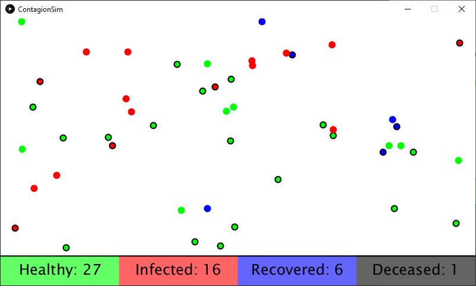

# ContagionSim
This is a simulation of pathogen spreading through interaction. 

Each dot represents a person. They can be in one of four states:

* Healthy
* Infected
* Recovered
* Deceased (removed from board)

When an infected person touches a healthy one, there is a chance that the contagion will spread. This chance is affected by masks. Masks are randomly assigned at the start of the simulation and are represented by a black outline.